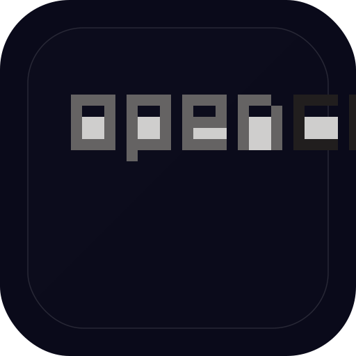

# OPEN CODE Mobile 🌊

> AI Coding Agent for Android — Liquid Glass Edition

  

  <strong>The most powerful AI coding assistant for your phone.</strong> 
  Liquid Glass UI • Multi-Model AI • Privacy First

---

## ✨ Features

- 🌊 **Liquid Glass Interface** — Stunning glass morphism design with floating particles and smooth animations
- 🤖 **Multi-Model AI** — GPT-4o, GPT-4, GPT-4o Mini, Claude 3.5 Sonnet, Claude 3 Opus, Claude 3 Haiku, Gemini 2.0 Flash, Gemini 2.0 Pro, Gemini 2.0 Ultra
- 🔐 **Sign in with Google** — Like ChatGPT, with profile management
- ⚡ **Real AI Integration** — Connect your own API keys for OpenAI, Anthropic, and Google
- 🎨 **3 Beautiful Themes** — Dark, Light, Ocean — each with Liquid Glass styling
- 💬 **Smart Code Blocks** — Syntax-highlighted code with one-tap copy
- 📱 **Mobile Native** — Built for Android, optimized for touch
- 🔒 **Privacy First** — Your API keys stay on your device

## 📲 Download

Download the latest APK from the [**Releases**](https://github.com/Il103/OPEN-CODE-Mobile/releases) page.

## 🤖 Supported Models

| Model | Provider | Type |
|-------|----------|------|
| Gemini 2.0 Flash | Google | Free |
| Gemini 2.0 Flash-Lite | Google | Free |
| GPT-4o Mini | OpenAI | Free |
| Claude 3 Haiku | Anthropic | Free |
| **GPT-4o** | **OpenAI** | **Premium** |
| **GPT-4 Turbo** | **OpenAI** | **Premium** |
| **GPT-4** | **OpenAI** | **Premium** |
| **Claude 3.5 Sonnet** | **Anthropic** | **Premium** |
| **Claude 3 Opus** | **Anthropic** | **Premium** |
| **Gemini 2.0 Pro** | **Google** | **Premium** |
| **Gemini 2.0 Ultra** | **Google** | **Premium** |

## 🎨 Liquid Glass Design

The entire interface is built around **glass morphism** — frosted glass effects, animated gradients, floating particles, and spring-based animations that make every interaction feel fluid and premium.

## 🔧 Setup

1. Download and install the APK
2. Sign in with Google or create an account
3. Add your API keys in Settings (OpenAI / Anthropic / Google)
4. Select your preferred model
5. Start coding!

---

  Made with ❤️ by Il103 
  Powered by <a href="https://opencode.ai">OPEN CODE</a>

